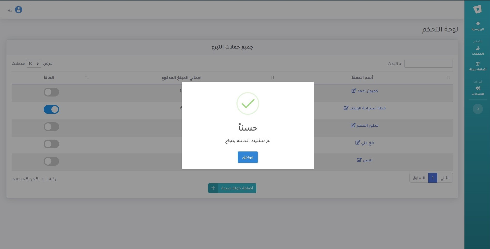

# Donation-Mangment V2

[![LinkedIn][linkedin-shield]][linkedin-url]
[![Twitter][twitter-shield]][twittwe-url]
[![Twitter][github-shield]][github-url]

<!-- PROJECT LOGO -->

  <!--  -->

  <h3 align="center">New Version of the System</h3>

  

A web application that aims to create donation campaigns and collect donor data and the amounts paid.     
    <a href="https://projects.iahmad.info/Donor">View Demo</a>
  

<!-- TABLE OF CONTENTS -->

  
<h2 style="display: inline-block">Table of Contents</h2>

  <ol>
    <li>
      <a href="#about-the-project">About The Project</a>
    </li>
    <li>
      <a href="#build_with">Build With</a>
    </li>
    <li><a href="#usage">Usage - Screenshots</a></li>
    <li><a href="#contact">Contact</a></li>
  </ol>

<!-- ABOUT THE PROJECT -->
## About The Project

**A full system for Donor registration has many properties:**
 
`Create New Donation`  `Mange Donors`  `Custom URL for donation`
 

<!-- Build With -->
## Build With
*  HTML & CSS
*  PHP Laravel
*  MySQL
* Javascript
* jQuery
* Ajax
* Bootstrap 4

<!-- USAGE EXAMPLES -->
## Usage  - Screenshots
After create account then you can create donation.

 

∎ Home page of dashboard

 

∎ Donations page

 

∎ Active a Donation 

 

∎ Home page of dashboard if there active Donation 

 

∎ Registering on donations page 

 

∎ Auto pay statues will be off 

 

∎ if change the pay statues to on 

<!-- CONTACT -->
## Contact

Ahmad Faqehi - [@A_F775](https://twitter.com/A_F775) - alfaqehi775@gmail.com

Project Link: [https://github.com/Ahmad-Faqehi/tvtc-guides](https://github.com/Ahmad-Faqehi/tvtc-guides)

<!-- MARKDOWN LINKS & IMAGES -->
<!-- https://www.markdownguide.org/basic-syntax/#reference-style-links -->
[linkedin-shield]: https://img.shields.io/badge/-LinkedIn-black.svg?style=for-the-badge&logo=linkedin&colorB=555
[linkedin-url]: https://linkedin.com/in/ahmad-faqehi
[twitter-shield]: https://img.shields.io/badge/-twitter-black.svg?style=for-the-badge&logo=twitter&colorB=555
[twittwe-url]: https://twitter.com/A_F775
[github-shield]: https://img.shields.io/badge/-github-black.svg?style=for-the-badge&logo=github&colorB=555
[github-url]: https://github.com/Ahmad-Faqehi
